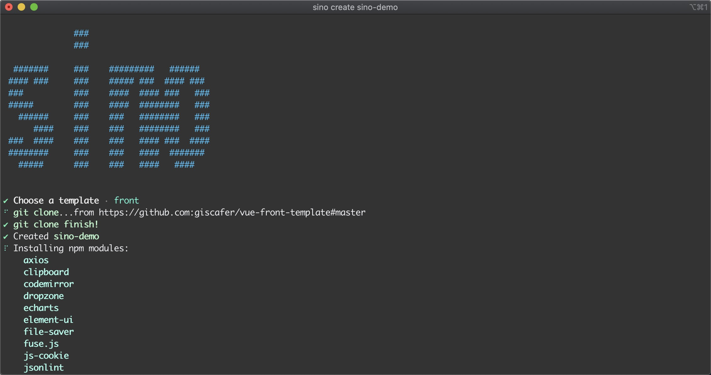

# @sinokit/cli


SinoKit 脚手架工具



## Quick Start

快速使用 cli 工具说明

安装工具，即可全局使用 `sino`

```
npm i @sinokit/cli -g
```

使用 `sino create` 命令从模板创建工程

```bash
sino create vue-demo
cd vue-demo
npm run dev
```

## License

MIT @giscafer
